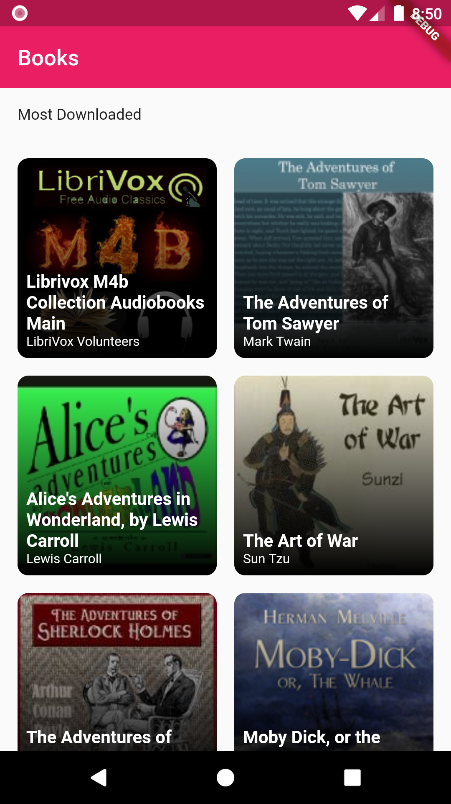
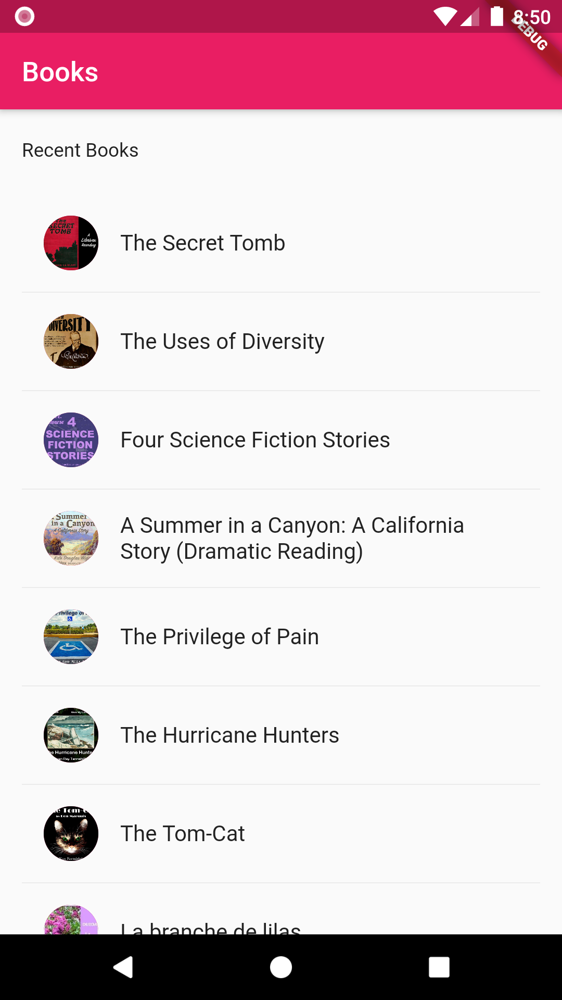
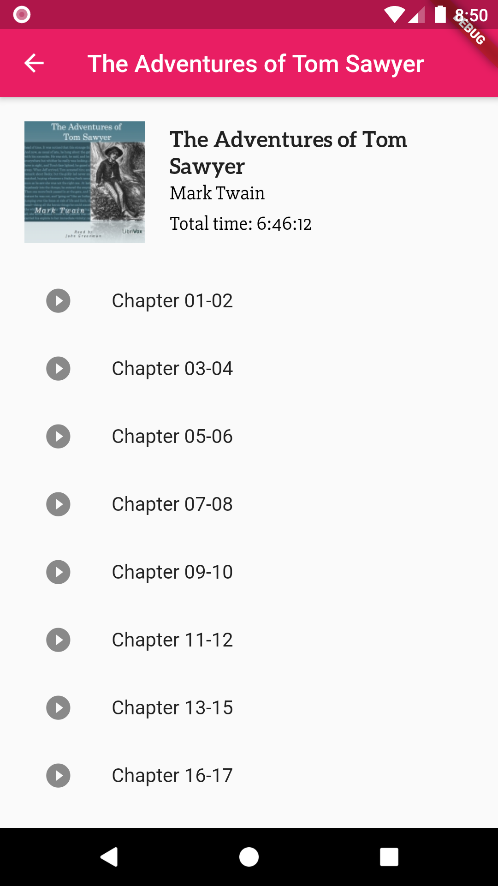
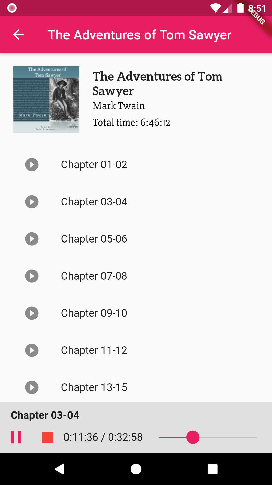

# Flutter AudioBooks

An audiobook listener and downloader in flutter using librivox API (WIP).

## Why?
I wanted to make a beautiful AudioBook app, free forever as librivox audiobooks are free too. I opene sourced it, as I thought people can learn from it and also they can help me build it to make it better.

## Screenshots
   