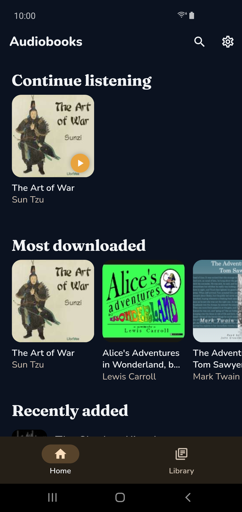
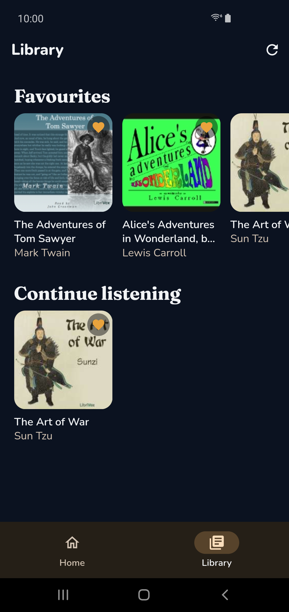
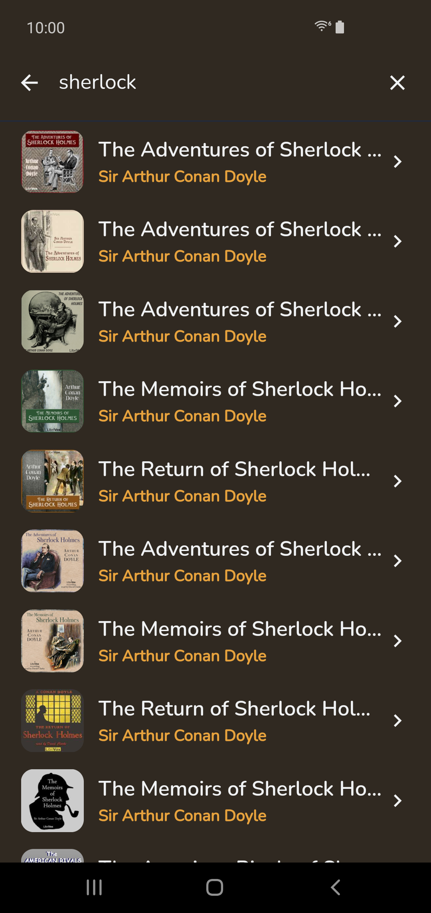

# Listora

Listora — a beautiful, free audiobook player for the public-domain
[LibriVox](https://librivox.org) catalogue (served via the
[Internet Archive](https://archive.org)). Browse, stream, download for offline
listening, and pick up right where you left off — all free, forever.

## Screenshots

   

## Features

- **Browse** — most-downloaded and recently-added books from the LibriVox collection
- **Search** by title *or* author; tap any author to see all their readings
  ("More by …" rails + a full author page)
- **Immersive player** — full-screen now-playing with a cover-colour gradient,
  scrubber, ±10s/30s, variable speed (persisted), and lock-screen / notification
  controls
- **Resume** — playback position is bookmarked per book and restored automatically
- **Sleep timer** — 15/30/45/60 min or end-of-chapter
- **Offline** — download single chapters or a whole book; downloaded chapters
  play from disk; per-chapter and per-book removal
- **Library** — Favourites, Continue listening, and Downloaded in one place
- **Favourites** — heart a book from its page or directly on any cover
- **Theming** — dark-first immersive UI (built on the
  [popup_bits_design](https://github.com/lohanidamodar/popup-bits-design-system)
  system) with light / dark / system modes

## Tech stack

- **Flutter 3.44** / Dart 3.12
- **State:** Riverpod 3 (hand-written providers, no codegen)
- **Audio:** `just_audio` + `just_audio_background`
- **Downloads:** `background_downloader`
- **Cache:** `sqflite` (catalogue) + `shared_preferences` (bookmarks, favourites, settings)
- **Theme:** `popup_bits_design` + `google_fonts` (Fraunces display)
- **Cover colours:** `palette_generator`

## Project layout

```
lib/
  main.dart                 app entry, ProviderScope, theme
  pages/                    main_shell, home, library, book_details,
                            now_playing, settings
  providers/                providers.dart (data/player/downloads/favourites),
                            settings_provider, sleep_timer_provider
  resources/                repository + archive.org API, sqflite cache,
                            audio_helper, downloads_service, favorites_service,
                            playback_bookmarks
  widgets/                  book_cards, mini_player, seek_bar, immersive_scrubber
```

## Running

The app targets a real device/emulator (audio + downloads).

```sh
flutter pub get
flutter run
```

## Release signing

Release builds are signed from credentials in `android/key.properties`, which
is **gitignored** (this is a public repo — the keystore and passwords are never
committed). If the file is absent, release falls back to debug signing so the
project still builds for anyone who clones it.

To set it up, copy `android/key.properties.example` to `android/key.properties`,
generate an upload keystore, and point `storeFile` at it:

```sh
keytool -genkey -v -keystore ~/upload-keystore.jks \
  -keyalg RSA -keysize 2048 -validity 10000 -alias upload
```

Keep the keystore and its passwords backed up somewhere safe and out of the
repo. Using **Google Play App Signing** is recommended (your committed key is
just an *upload* key, which can be reset if lost).

## Store assets

Ready-to-upload Play Store art lives in `playstore_screenshots/`: the listing
icon (`play_store_icon_512.png`), `feature_graphic.png`, raw phone screenshots,
and branded marketing frames under `marketing/`. The launcher icon is generated
with `flutter_launcher_icons` (`dart run flutter_launcher_icons`).

## License & content

App code is open source. All audiobook content is public domain, provided by
LibriVox volunteers via the Internet Archive.
